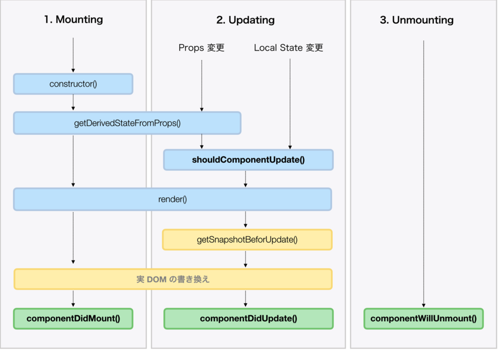
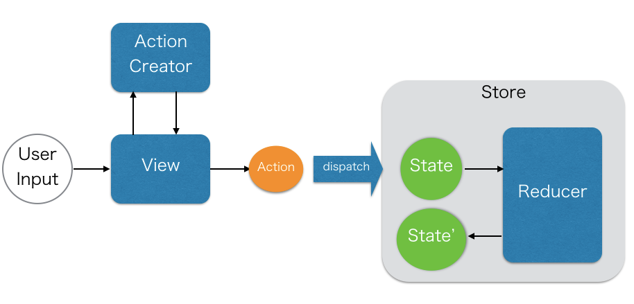

# りあクト！ TypeScript で始めるつらくない React 開発

##　環境構築について

create-react-appをするとアプリのスケルトンと3つのパッケージがインストールされる。

- reactはReact本体のパッケージ
- react-dom は DOM を抽象化して React から操作できるようにするレンダラーのパッケージ
- react-scripts の後ろには 50 個以上のパッケージが隠蔽されてる

- Babel 新しい仕様の JavaScript や JSX、TypeScript のコードを古いブラウザでも実行可能なレガシーな
JavaScript にコンパイルする
- webpack コンパイラと連携しつつ大量のソースコードファイルをひとつにまとめ、種々の最適化を施す
- webpack-dev-server ファイルの変更を自動検知して再ビルド、リロードしてくれる開発用の HTTP サーバでのアプリ
の稼働
- jest オールインワンのテスティングフレームワークによるユニットテストの記述

## TypeScriptに関して

varは再代入も再宣言もできる。letは再代入はできるが、再宣言ができない。constはどちらもできない。
varは宣言の前に代入できてしまう、これを巻き上げ(Hoisting)という
varはスコープがブロックスコープではなく関数単位である

constは不変だが、配列やオブジェクトの各要素の上書きなどはできてしまう。

```javascript
const arr = [1, 2, 3];
arr[0] = 7;
> arr
[ 7, 2, 3 ]
```

### コンパイル設定

TypeScriptのコンパイル設定はtsconfig.jsonファイルで行われる。
コンパイラは明示的に指定されなかった場合、実行されたカレント ディレクトリから、親ディレクトリへとさかのぼって tsconfig.json ファイルを探し出して読み込む

## async関数について

async で定義された Async 関数は、本文中に await を前置きすることで、他の
Async 関数の実行結果を待ってくれる

async/await はじつのところ Promise 構文のシンタックスシュガー
Async 関数は隠されてるだけで暗黙のうちに Promise オブジェクトを返している

「シンタックスシュガーとは、プログラミング言語の読み書きのしやす さのために、既に存在する構文に別の記法を与えたもの。 糖衣構文と訳される」


## 第 7 章 何はなくともコンポーネント

コンポーネントで大事な要素
• Props　親コンポーネントから受け取る値
• Local State　コンポーネント自身が内部に持つ状態
• ライフサイクル　初期化されてマウントされレンダリングされ、何らかの処理が行われて再レンダリングされたりして、最後にアンマウントされるまでの過程

### ライフサイクル

1. Mounting ...... コンポーネントが生成され DOM ノードに挿入されるフェーズ
2. Updating ...... 変更を検知してコンポーネントが再レンダリングされるフェーズ
3. Unmounting ...... コンポーネントが DOM ノードから削除されるフェーズ
4. Error Handling ...... そのコンポーネント自身および子コンポーネントのエラーを捕捉する



ライフサイクルの各フェーズに介入して任意の処理を差し込むことができるメソッドが、React のコンポーネントには用意されており、これをライフサイクルメソッドと呼ぶ
主なライフサイクルメソッド
```
componentDidMount() 戻り値型 void コンポーネントがマウントされた直後に呼ばれる
shouldComponentUpdate(nextProps, nextState) 戻り値型 boolean  再レンダリングの直前に呼ばれ、false を返せば再レンダリングを中止できる
componentDidUpdate(prevProps,prevState, snapshot?)  戻り値型 void  コンポーネントが変更された直後に呼ばれる
componentWillUnmount() 戻り値型 void  コンポーネントがアンマウントされる直前に呼ばれる
```

### 関数コンポーネント

関数コンポーネントはまず Local State を持つことができない。そしてライフサイクルメソッドを備えられない
`SFC`は 『Stateless Function Component』の略。StatelessComponent という型の Type Alias
状態を持たなければ副作用も起きにくい。だから React では関数コンポーネントを積極的に利用するべき

## 第 8 章 合成するぞ Recompose

Presentational Component と Container Componentの二種類ある
関数コンポーネントも、外から機能を追加されることで Container Component になることができる。
それを実現するのがHOC、Higer Order Componentである。
HOCとはコンポーネントを引数にとって、戻り値としてコンポーネントを返す関数のことである

### Presentational Component

「どのように見えるか」に関心を持つ
内部に DOM マークアップをふんだんに持つ
データやふるまいを Props として一方的に受け取る
Flux の Store 等に依存しない
自身の状態を持たない(UIに関しては例外)
データの変更に介入しない
関数コンポーネントで表現されることが多い

### Container Component

「どのように機能するか」に関心を持つ
DOM マークアップを可能な限り持たない
データやふるまいを他のコンポーネントに受け渡す
Flux の Action を実行したり、Flux の Store に依存する
しばしばデータの状態を持つ
しばしばデータの変更に介入して、任意の処理を行う
HOCが多用される(Higer Order Component)

### Recompose

関数コンポーネントにライフサイクルメソッドや Local State を追加したり、複数の HOC を 合成してひとつにまとめたり、といった API が提供されている


## Redux

Reduxは、actionsと呼ばれるイベントを使ってUIのstate(状態)を管理をするためのフレームワーク。Reactではstateの管理するデータフローにFluxを提案しているが、ReduxはFluxの概念を拡張してより扱いやすく設計されている。




### Action

アプリケーションで起こった何かを記述するイベント

アプリからstoreやデータを送るためのpayloadを渡す役割

プレーンなjavascriptオブジェクト

type propertyをstring型で必ず持つ必要があり"domain/eventName"のような形式で記述されることが多い。

```javascript
const addTodoAction = {
  type: 'todos/todoAdded',
  payload: 'Buy milk'
}
```

### Action Creator

actionオブジェクトを創り返す関数である。

繰り返しactionオブジェクトを書く必要がないようにactionオブジェクトを創る時に使う。

```javascript
const addTodo = text => {
  return {
    type: 'todos/todoAdded',
    payload: text
  }
}
```

### Reducers

現在のstateとactionを受け取って必要であればどのようにstateをupdateするかを決める関数。

新しいstateをreturnする。

action typeに応じてeventsをhandleするevent listenerのようなもの

```
"Reducer" functions get their name because they're similar to the kind of callback function you pass to the Array.reduce() method.
```

#### ルール

- 引数に受け取ったstateとactionに基づいて新しいstateを計算する
- 既存のstateを変更することはできない。その代わり既存のstateをコピーしコピーした値に変更を加える
- 非同期ロジックやランダムな計算などいかなる副作用も引き起こさない

```javascript
const initialState = { value: 0 }

function counterReducer(state = initialState, action) {
  // Check to see if the reducer cares about this action
  if (action.type === 'counter/increment') {
    // If so, make a copy of `state`
    return {
      ...state,
      // and update the copy with the new value
      value: state.value + 1
    }
  }
  // otherwise return the existing state unchanged
  return state
}
```


# 参考

公式doc
https://redux.js.org/tutorials/essentials/part-1-overview-concepts

https://www.youtube.com/watch?v=so0JgVToRLk&list=PLX8Rsrpnn3IWavNOj3n4Vypzwb3q1RXhr&index=3

https://qiita.com/kitagawamac/items/49a1f03445b19cf407b7
